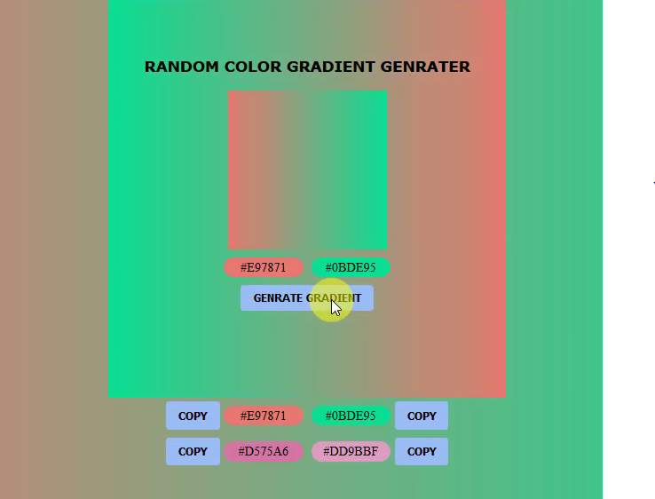

# Random-Color-Gradient-Genrater-in-Javascript
Genrate random color gradient in html Document copy color on clipboard, use for your projects ans UI &amp; UX Designe

[] [instagram] :https://instagram.com/parvindercoder

